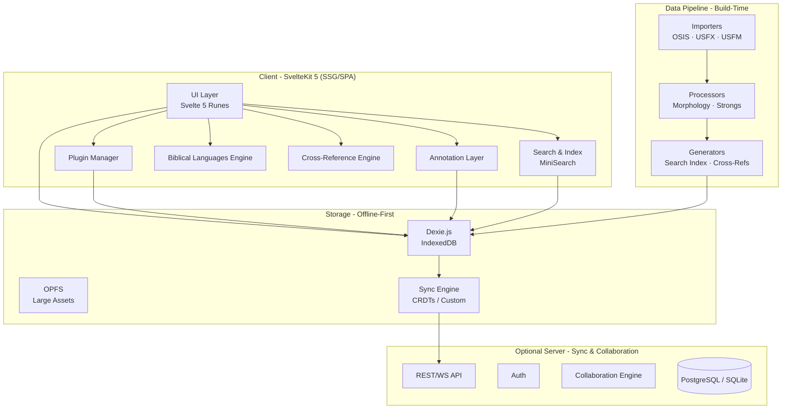
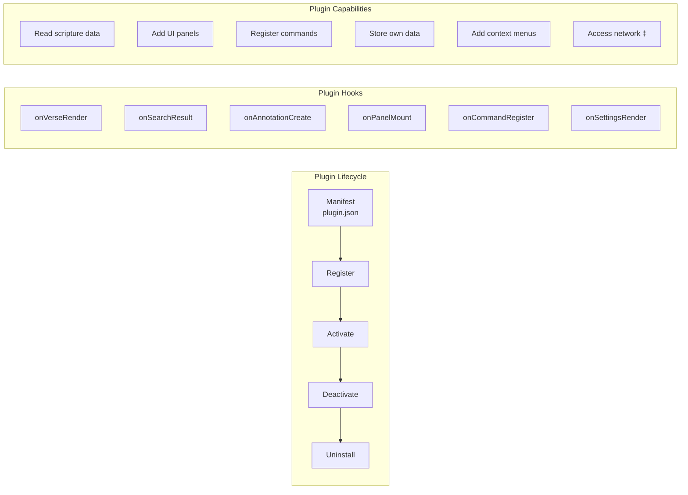
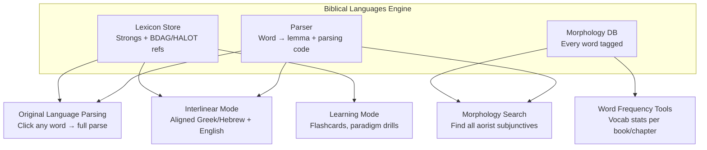
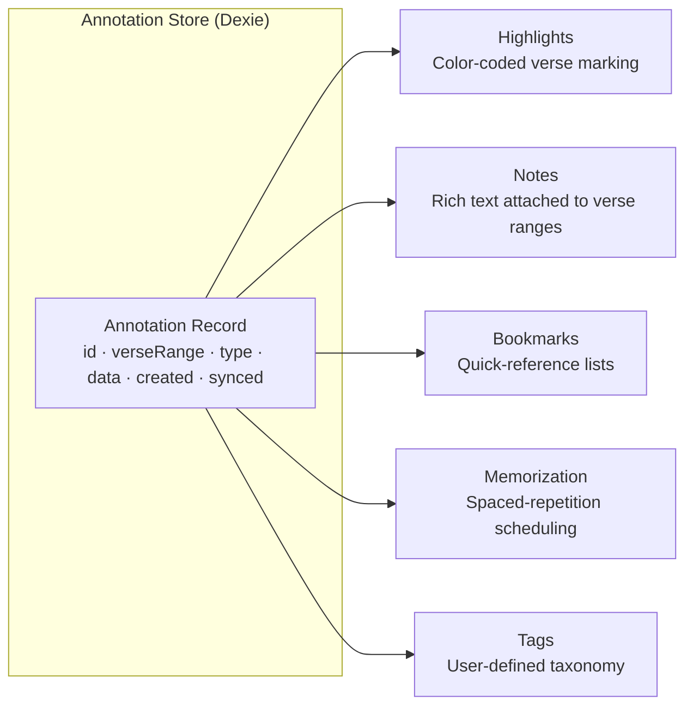
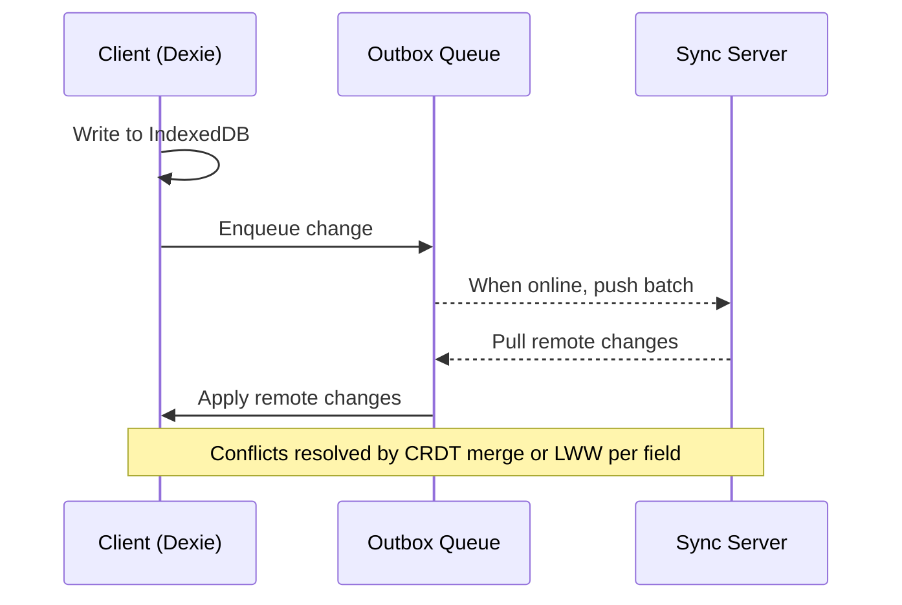
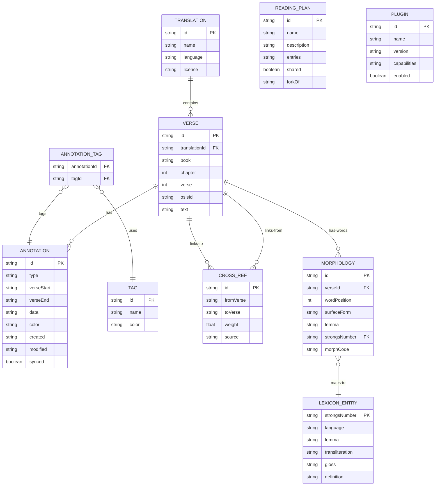

# Codex Scriptura - Project Architecture & Release Plan

> A plugin-extensible, offline-first Bible study platform for scholars, students, and missionaries.

---

## 1. Vision & Competitive Position

Codex Scriptura is not another Bible app. It is a **research-grade, extensible platform** that competes with Logos Bible Software's 20-year head start through:

1. **Plugin architecture** - community-driven feature velocity vs. monolithic vendor lock-in
2. **Offline-first** - scholars on planes, missionaries in villages, seminaries with bad Wi-Fi
3. **Two killer features** no competitor has: **Doctrine Development Tracker** and **Manuscript Comparison**
4. **Open data formats** - import from / export to Logos, Accordance, e-Sword

---

## 2. Architecture Overview



### 2.1 Technology Stack

| Layer | Choice | Rationale |
|-------|--------|-----------|
| **Framework** | SvelteKit 5 (Runes mode) | Already scaffolded; SSG for offline, SPA for interactivity |
| **Local DB** | Dexie.js (IndexedDB) | Already installed; offline-first, reactive queries |
| **Search** | MiniSearch | Already installed; fast in-browser full-text search |
| **Large assets** | OPFS (Origin Private File System) | Audio, maps, manuscript images - too large for IndexedDB |
| **Sync** | CRDTs (Yjs) or custom last-write-wins | Offline-first needs conflict resolution |
| **Data pipeline** | Node.js/tsx scripts in `packages/data-pipeline` | Already working (KJV importer done) |
| **Monorepo** | pnpm workspaces | Already configured |
| **Testing** | Vitest + Testing Library | Already in devDeps |

### 2.2 Monorepo Package Map

```
codex-scriptura/
├── packages/
│   ├── core/              # Bible reference parsing, canonical book lists, shared types
│   ├── db/                # Dexie schema, repositories, migration system
│   ├── data-pipeline/     # XML importers, morphology processors, index builders
│   ├── plugin-api/        # Plugin lifecycle, hooks, sandboxing, manifest schema
│   ├── languages/         # Biblical Languages Engine (Greek/Hebrew/Aramaic)
│   └── sync/              # Sync engine, CRDT integration, conflict resolution
├── plugins/
│   ├── example-votd/      # Example: Verse of the Day (reference plugin)
│   ├── audio-bible/       # Audio playback integration
│   ├── maps/              # Biblical geography & maps
│   ├── ai-assistant/      # LLM-powered study assistant
│   └── ...                # Community plugins
├── src/                   # SvelteKit app (UI shell)
│   ├── lib/
│   │   ├── components/    # Shared UI components
│   │   ├── stores/        # Svelte stores / rune-based state
│   │   ├── engines/       # Cross-ref engine, search engine wrappers
│   │   └── utils/         # Formatting, date, etc.
│   └── routes/
│       ├── +layout.svelte # App shell: sidebar, command palette
│       ├── read/          # Bible reader (primary view)
│       ├── search/        # Search results
│       ├── study/         # Study tools dashboard
│       ├── library/       # Commentary & Church Fathers browser
│       ├── graph/         # Cross-reference graph visualization
│       ├── doctrine/      # Doctrine Development Tracker
│       └── settings/      # User prefs, plugin management, sync
├── data/
│   ├── texts/             # Source XML files (gitignored)
│   └── processed/         # Pipeline output JSON (gitignored)
└── static/                # Fonts, icons, manifest.json
```

---

## 3. Core Systems Architecture

### 3.1 Plugin System

> [!IMPORTANT]
> The plugin system is the single most important architectural decision. Every feature that isn't "read a Bible verse" should be theoretically possible as a plugin.



**Plugin types:**
- **Panel plugins** - render into sidebar/bottom panels (e.g., commentary, maps)
- **Overlay plugins** - render inline with verse text (e.g., interlinear, morphology highlights)
- **Data plugins** - add new texts, translations, or datasets (e.g., Church Fathers, Dead Sea Scrolls)
- **Command plugins** - add keyboard shortcuts and command palette actions
- **Import/Export plugins** - handle foreign formats (Logos, e-Sword, Accordance)

**Sandboxing:** Plugins run in an iframe or Web Worker with a message-passing API. They can request capabilities (network, storage, UI slots) declared in their manifest. User approves capabilities on install.

---

### 3.2 Biblical Languages Engine

One engine, four surfaces:



**Data sources (all public domain / open license):**
- OSHB (Open Scriptures Hebrew Bible) - morphology-tagged Hebrew
- SBLGNT or Nestle-Aland (where licensable) - morphology-tagged Greek
- Strongs Concordance - lexicon keys
- OpenBible.info cross-references

---

### 3.3 User Annotation Layer

One data model, multiple UI surfaces:



All annotations are **syncable, exportable, and shareable**. The same underlying record can be a highlight, a note, a bookmark - determined by `type` field. This means:
- Searching notes also searches bookmarks
- Exporting annotations gets everything
- Sync handles all annotation types uniformly

---

### 3.4 Offline-First + Sync Strategy



**Offline tiers:**
1. **Tier 0 (always offline):** Bible text, search index, user annotations - all in IndexedDB
2. **Tier 1 (cache on first use):** Commentaries, Church Fathers texts, lexicon data
3. **Tier 2 (online optional):** Collaboration, sync, plugin marketplace
4. **Tier 3 (online required):** AI assistant, shared reading plans, external API plugins

---

### 3.5 Cross-Reference Graph

Built on the OpenBible.info cross-reference dataset (340,000+ cross-refs). Rendered with a force-directed graph (D3.js or Cytoscape.js).

**Nodes** = verses or passages. **Edges** = cross-reference links with strength weights.

Features:
- Click any verse → see all connected verses as a graph
- Filter by testament, book, topic
- User can add their own cross-reference edges
- Plugin hook: plugins can add edges (e.g., "thematic links" plugin)

---

## 4. Feature Inventory

### 4.1 Core Features (Built into the platform)

| # | Feature | System | Notes |
|---|---------|--------|-------|
| C1 | Multi-translation Bible reader | UI + DB | Parallel view, split pane |
| C2 | Full-text search | MiniSearch + DB | Instant results, regex support |
| C3 | Cross-Reference Graph | Cross-Ref Engine | Force-directed visualization |
| C4 | Highlights, Notes, Bookmarks | Annotation Layer | Unified data model |
| C5 | Verse memorization (spaced repetition) | Annotation Layer | SM-2 algorithm |
| C6 | Biblical Languages Engine | Languages pkg | Parse, interlinear, morphology search, frequency |
| C7 | Manuscript Comparison | Languages pkg + UI | Side-by-side textual variant display |
| C8 | Doctrine Development Tracker | Dedicated module | Timeline of doctrine through church history |
| C9 | Church Fathers Library | Data plugins | Public domain patristic texts |
| C10 | Plugin system | Plugin API | Lifecycle, hooks, sandboxing, marketplace |
| C11 | Offline-first with sync | Sync Engine | CRDTs, outbox queue |
| C12 | Import/Export (Logos, Accordance, e-Sword) | Import/Export plugins | Migration paths to steal users |
| C13 | Citation export | Core utility | Turabian / Chicago / SBL one-click cite |
| C14 | Reading plans (create, share, fork) | Annotation Layer | "GitHub for reading plans" |
| C15 | Collaboration mode | Sync + UI | Shared annotations for study groups |
| C16 | Command palette + keyboard shortcuts | UI | Cmd+K power-user interface |

### 4.2 Plugin Features (Shipped as official plugins, not core)

| # | Feature | Plugin | Notes |
|---|---------|--------|-------|
| P1 | Audio Bibles | `audio-bible` | Stream or cache audio per chapter |
| P2 | Maps & Biblical Geography | `maps` | Interactive maps with event overlays |
| P3 | AI Study Assistant | `ai-assistant` | LLM integration with clean interface boundary |
| P4 | Timeline Mode | `timeline` | Visual historical timeline of biblical events |
| P5 | Verse of the Day | `example-votd` | Already scaffolded as reference plugin |
| P6 | Commentary integrations | `commentary-*` | Matthew Henry, Calvin, etc. |
| P7 | Journal / Devotional | `journal` | Long-form writing tied to passages |
| P8 | Quote Verification | `quote-verify` | Manual workflow + search integration |

---

## 5. Release Plan

### Versioning Scheme

```
v0.MAJOR.PATCH
│  │     │
│  │     └── Bug fixes, performance, polish within same feature set
│  └──────── Feature milestone (each adds a significant capability)
└─────────── Pre-1.0 (not production-stable)
```

`v1.0.0` = first production release with plugin marketplace, sync, and collaboration.

---

### v0.1.0 - "Foundation" (Reader & Data)

> **Goal:** A usable Bible reader with search. Prove the architecture works.

| Task | Package | Details |
|------|---------|---------|
| KJV importer | `data-pipeline` | ✅ Done (36,820 verses) |
| Bible reference parser | `core` | Parse "John 3:16", "Gen 1:1-3", ranges, multi-chapter |
| Dexie schema v1 | `db` | `translations`, `verses`, `settings` tables |
| Seed script | `data-pipeline` | Load `kjv-verses.json` → IndexedDB on first launch |
| Reader UI | `src/routes/read/` | Chapter view, verse numbers, translation picker |
| Full-text search | `src/routes/search/` | MiniSearch integration, instant results |
| App shell | `src/routes/+layout` | Sidebar nav, responsive layout, dark/light theme |
| OEB importer | `data-pipeline` | Second translation (Open English Bible, already in `data/texts/`) |
| WEB importer | `data-pipeline` | Third translation (World English Bible USFX format) |

**v0.1.1** - Bug fixes: reader scroll position, search ranking tuning, mobile layout fixes
**v0.1.2** - Performance: lazy-load chapters, search index caching, preload adjacent chapters

---

### v0.2.0 - "Annotate" (User Data Layer)

> **Goal:** Users can highlight, note, bookmark, and tag. Data persists offline.

| Task | Package | Details |
|------|---------|---------|
| Annotation data model | `db` | Unified `annotations` table with type discriminator |
| Highlight UI | `src/lib/components/` | Select text → color picker → save |
| Notes UI | `src/lib/components/` | Rich text editor (Tiptap) attached to verse ranges |
| Bookmarks & tags | `src/routes/study/` | List view, filter by tag, quick navigation |
| Annotation export | `core` | Export as JSON, Markdown, or plain text |
| Command palette | `src/lib/components/` | Cmd+K → navigate, search, quick actions |
| Search Upgrade | `src/routes/search/` | Multi-translation search (drop `.equals('KJV')`) |

**v0.2.1** - Fix: annotation overlap rendering, tag autocomplete, undo support
**v0.2.2** - Polish: drag-to-extend highlight, bulk tag operations, annotation count badges

---

### v0.3.0 - "Languages" (Biblical Languages Engine)

> **Goal:** Click a word, see its parsing. View interlinear text. Search by morphology.

| Task | Package | Details |
|------|---------|---------|
| Strongs concordance importer | `data-pipeline` | Map Strongs numbers → lexicon entries |
| OSHB morphology importer | `data-pipeline` | Hebrew word-level morphology tags |
| SBLGNT morphology importer | `data-pipeline` | Greek word-level morphology tags |
| Obsidian-style graph | `src/routes/graph/` | Visual map of interconnected verses |
| Tooltip previews | `src/lib/components/` | Hover a cross-ref to read the passage instantly |
| Interlinear mode | `src/routes/read/` | Toggle: aligned original + translation |
| **Settings Engine** | `core` & `db` | Singleton `UserPreferences` in Dexie with Rune `$state` |
| **Theme & Layout UI** | `src/routes/settings/` | UI mapping preferences to `:root` CSS variables |
| Morphology search | `src/routes/search/` | "Find all aorist passive indicatives in Romans" |
| Word frequency view | `src/routes/study/` | Vocab stats per book, chapter, or corpus |
| Strong's Search | `src/routes/search/` | Search H430 → find all verses with Elohim |

**v0.3.1** - Fix: parsing edge cases (ketiv/qere, textual variants), interlinear alignment bugs
**v0.3.2** - Polish: learning mode flashcards, paradigm tables, vocabulary by frequency rank

---

### v0.4.0 - "Connect" (Cross-References & Graph)

> **Goal:** Explore scripture connections visually. Build the graph view.

| Task | Package | Details |
|------|---------|---------|
| Cross-reference data import | `data-pipeline` | OpenBible.info dataset (340k+ refs) |
| Cross-ref store | `db` | `crossRefs` table with weight/type |
| Inline cross-refs | `src/routes/read/` | Hover a verse → see linked passages |
| Graph visualization | `src/routes/graph/` | Force-directed graph (D3 or Cytoscape) |
| Graph filters | `src/routes/graph/` | Filter by book, testament, topic, weight |
| User cross-refs | Annotation layer | Users add their own connections |
| Semantic/Topical Search | `src/routes/search/` | "verses about forgiveness" → graph traversal |
| Reference Search | `src/routes/search/` | Type "John 3:16" → jump directly via regex |

**v0.4.1** - Fix: graph performance with large ref clusters, edge label rendering
**v0.4.2** - Polish: graph layout algorithms, zoom-to-fit, share a graph snapshot

---

### v0.5.0 - "Extend" (Plugin System)

> **Goal:** Third-party developers can build and install plugins.

| Task | Package | Details |
|------|---------|---------|
| Plugin manifest schema | `plugin-api` | `plugin.json`: name, version, capabilities, hooks |
| Plugin lifecycle | `plugin-api` | Register → activate → deactivate → uninstall |
| Hook system | `plugin-api` | `onVerseRender`, `onSearch`, `onAnnotation`, `onPanel` |
| Sandboxed runtime | `plugin-api` | iframe or Worker isolation, message-passing API |
| Plugin settings UI | `src/routes/settings/` | Install, enable/disable, configure per-plugin |
| Reference plugins | `plugins/` | Upgrade `example-votd`, add `commentary-matthew-henry` |
| Plugin developer docs | Root | README, API reference, tutorial: "Build your first plugin" |
| **Book Metadata** | `core` | Extend `BookMeta` with `canons`, `manuscripts`, `summary`, `historicalContext` |
| Book Info panel | `src/routes/read/` | Display metadata per book in the reader (accessible via dropdown) |
| Annotation Search | `src/routes/search/` | Search index expanded to include user notes and highlights |

**v0.5.1** - Fix: plugin crash isolation, memory leaks on deactivate, lifecycle edge cases
**v0.5.2** - Polish: plugin hot-reload in dev, typed SDK package, plugin template generator

---

### v0.6.0 - "Scholar" (Killer Features)

> **Goal:** Doctrine Tracker and Manuscript Comparison - the features nobody else has.

| Task | Package | Details |
|------|---------|---------|
| Doctrine Development Tracker | `src/routes/doctrine/` | Timeline view of how doctrines evolved through church councils, creeds, Church Fathers |
| Doctrine data model | `db` | `doctrines`, `doctrineEvents`, `doctrineVerses` tables |
| Church Fathers importer | `data-pipeline` | CCEL/NewAdvent public domain patristic texts |
| Church Fathers reader | `src/routes/library/` | Browse, search, cite patristic works |
| Manuscript Comparison | `src/routes/read/` | Side-by-side textual variant display (Alexandrian vs Byzantine, etc.) |
| Apparatus data import | `data-pipeline` | Textual apparatus (where open-licensed data exists) |
| Citation export | `core` | One-click cite to Turabian / Chicago / SBL format |

**v0.6.1** - Fix: doctrine timeline rendering, Church Fathers text encoding issues
**v0.6.2** - Polish: apparatus visual diff, citation clipboard formatting

---

### v0.7.0 - "Sync & Collaborate"

> **Goal:** Multi-device sync. Study group shared annotations.

| Task | Package | Details |
|------|---------|---------|
| Sync engine | `packages/sync/` | Outbox queue, batch push/pull, conflict resolution |
| CRDT integration | `packages/sync/` | Yjs for annotations and reading plans |
| Auth | Server component | OAuth2 (Google, Apple) + email/password |
| Collaboration mode | `src/routes/study/` | Shared annotation layers for study groups |
| Reading plans | Annotation layer | Create, share, fork plans with progress tracking |
| Sync settings | `src/routes/settings/` | Enable/disable sync, link devices, manage groups |

**v0.7.1** - Fix: sync conflict edge cases, offline queue overflow, auth token renewal
**v0.7.2** - Polish: real-time presence indicators, merge conflict UI

---

### v0.8.0 - "Migrate" (Import/Export)

> **Goal:** Migration paths from competing platforms.

| Task | Package | Details |
|------|---------|---------|
| Logos PBB/LBX importer | Import plugin | Parse Logos personal book annotations |
| Accordance import | Import plugin | HiLites and notes import |
| e-Sword import | Import plugin | .bblx and .topx format support |
| Universal export | `core` | Export all user data as portable JSON bundle |
| OSIS/USFM export | `data-pipeline` | Export annotated text for other tools |

**v0.8.1** - Fix: encoding issues in imported data, format version compatibility

---

### v0.9.0 - "Polish" (Pre-release Hardening)

> **Goal:** Performance, accessibility, PWA install experience, documentation.

| Task | Details |
|------|---------|
| PWA manifest & service worker | Install prompt, full offline capability |
| Performance audit | < 2s first load, < 100ms chapter navigation |
| Accessibility audit | WCAG 2.1 AA compliance, screen reader support |
| Mobile responsive pass | Tablet + phone layouts |
| Onboarding flow | First-run wizard: pick translations, import data, tutorial |
| User documentation | Help pages, keyboard shortcut reference |
| Plugin marketplace UI | Browse, install, rate community plugins |

**v0.9.1–v0.9.x** - Bug fixes and polish leading up to v1.0

---

### v1.0.0 - "Launch"

> **Goal:** Production-stable release. All core features working. Plugin ecosystem seeded.

**Includes everything from v0.1–v0.9 plus:**
- Stable plugin API (no more breaking changes without major version bump)
- Migration wizard for Logos/Accordance/e-Sword users
- Sync server deployment guide (self-host or managed)
- Landing page and documentation site
- **Advanced Search:** Boolean operators (`"faith" AND "works" NOT "law"`) and proximity search.

---

## 6. Data Model Overview



### Future: Book Metadata (v0.5.0)
The `BookMeta` type in `packages/core/src/books.ts` will be extended:

```typescript
export type BookMeta = {
    osisId: string;
    name: string;
    abbrev: string;
    testament: Testament;
    chapters: number;
    // v0.5.0 additions:
    canons?: Canon[];          // ['protestant', 'catholic', 'orthodox']
    manuscripts?: string[];     // ['MT', 'LXX', 'DSS', 'Vulgate']
    summary?: string;
    historicalContext?: string;
};
```

This is **static reference data** baked into the `core` package - no new Dexie table required.

### Future: User Preferences (v0.3.0)
The Settings table will store a singleton preferences object mapping directly to global UI states:

```typescript
export interface UserPreferences {
    id: 'default'; // Singleton pattern
    theme: 'light' | 'dark' | 'system';
    accentColor: string; // e.g., '#3b82f6'
    fontOptions: {
        primary: string; // English
        greek?: string;
        hebrew?: string;
        size: number; // Base rem/px
        lineSpacing: number; // e.g., 1.5
    };
    readerOptions: {
        layoutDensity: 'compact' | 'comfortable' | 'spacious';
        viewMode: 'single' | 'parallel';
        showInterlinear: boolean;
    };
    highlightPresets: {
        id: string;
        color: string;
        label: string;
    }[];
}
```

This model is loaded on app-boot into a root Svelte 5 `$state` rune. A global `$effect` actively proxies these variables into CSS Custom Properties (e.g. `--font-size-base`, `--color-accent`) on the `document.documentElement` to natively style the app without framework overhead. Any changes to the `$state` trigger a debounced `put()` back to Dexie. Future plugins will be able to inject their own schemas into the settings object safely via a registration API.

> **Field notes:** `ANNOTATION.type` = highlight, note, bookmark, or memorization. `ANNOTATION.data` = JSON payload. `CROSS_REF.source` = openbible, user, or plugin. `LEXICON_ENTRY.language` = hebrew or greek. `READING_PLAN.entries` and `PLUGIN.capabilities` = JSON arrays.

---

## 7. Non-Functional Requirements

| Requirement | Target | Notes |
|-------------|--------|-------|
| **First load** | < 2s on 3G | SSG bundle + lazy-load heavy features |
| **Chapter nav** | < 100ms | Preloaded adjacent chapters in IndexedDB |
| **Search** | < 200ms for 36k verses | MiniSearch in-memory index |
| **Offline** | 100% core features | Only sync/collab needs network |
| **Storage** | < 50MB base install | KJV text + index ≈ 8MB, each translation ≈ 5-8MB |
| **Accessibility** | WCAG 2.1 AA | Keyboard nav, screen reader, high contrast |
| **Browser support** | Chrome 90+, Firefox 90+, Safari 15+ | IndexedDB + OPFS support required |

---

## 8. Current State (as of v0.2.0)

| Component | Status |
|-----------|--------|
| Monorepo structure | ✅ Configured (pnpm workspaces) |
| SvelteKit shell | ✅ App shell with sidebar, theme toggle |
| `data-pipeline` | ✅ KJV, OEB, WEB importers working |
| `db` | ✅ Dexie v2 schema (verses, translations, annotations, tags, settings) |
| `core` | ✅ Canonical BOOKS array (81 books), reference parser, types |
| Annotation layer | ✅ Highlights, notes, tags - persisted in IndexedDB |
| PWA + Service Worker | ✅ Cache-first strategy, offline capable |
| `plugin-api` | 🔲 Stub only |
| `plugins/example-votd` | 🔲 Empty directory |
