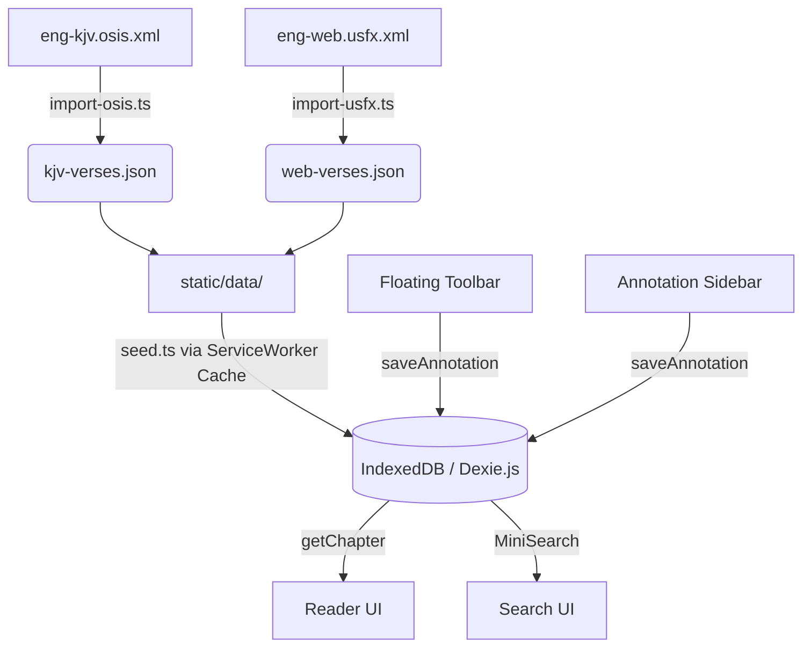

# Codex Scriptura — Walkthrough

## v0.2.0 "Annotate" Features

### Translation-Agnostic Annotations
Because Codex Scriptura supports switching between multiple translations (KJV, WEB, OEB) seamlessly, we engineered the Annotation system to be **Translation-Agnostic**. 
Highlights, Notes, and Tags are anchored strictly to **OSIS IDs** (e.g. `John.3.16`), rather than HTML character string-offsets. This guarantees that if you highlight a verse in one translation, the highlight survives switching to entirely different translations!

### Verse Selection & Floating Toolbar
- Users click verses to toggle them into a `selected` state, bypassing messy/brittle native browser text-selection range APIs on mobile and desktop.
- Selecting one or more verses triggers a floating, sticky **Selection Toolbar** at the bottom of the screen.
- The toolbar offers **4 distinct Highlight Colors**, a **Note Writer**, a **Copy to Clipboard** utility, and a clear state button.

### Annotations Sidebar & Note Editor
- Choosing "Note" from the Toolbar opens the [AnnotationSidebar.svelte](file:///home/steveaj/Projects/codex-scriptura/src/lib/components/AnnotationSidebar.svelte) drawer.
- The Sidebar provides a rich-text writing environment tied specifically to the passage selection.
- **Tag Management:** Users can type custom tags (`#grace`, `#theology`) which are saved to the Dexie `tags` table and persist across the entire app for future auto-completion.
- A secondary view in the Sidebar renders a feed of all previously written notes for the currently active Chapter, complete with delete controls and tag pills.
- Verses with attached notes render with a subtle underline to visually indicate metadata presence.

### Book Navigation & Data Integrity Fixes
- **3 Missing Apocryphal Books:** Added `EsthGr` (Greek Esther), `EpJer` (Epistle of Jeremiah), and `2Esd` (2 Esdras) to the canonical `BOOKS` array. All three now appear in the book selector dropdown.
- **Canonical Book Ordering:** [getBookList()](file:///home/steveaj/Projects/codex-scriptura/packages/db/src/index.ts#58-72) now returns *only* recognized books in canonical order (Genesis → Revelation). Unrecognized OSIS IDs from any translation source are silently excluded.
- **Empty-Chapter Skipping:** `loadChapter()` auto-advances to the first non-empty chapter. `navigateToBook()` starts at the first chapter with actual verses (e.g. Greek Esther → ch 10).
- **Dexie v2 Schema Upgrade:** Bumped to version 2 with a proper upgrade path to ensure the `book` index exists on the annotations table.
- **Svelte 5 Proxy Fix:** Spread `$state` Proxy arrays into plain arrays before passing to Dexie's `put()` to avoid `DataCloneError`.

---

## v0.1.0 "Foundation" Snapshot

### SvelteKit App & Monorepo Packages
The foundation of the offline-first Bible study app has been built across a monorepo structure:
- `packages/core`: Base typings, Canonical 81-book lists, and the `BibleReference` parsing engine.
- `packages/db`: Offline persistence using Dexie.js with 5 tables and compound indexes.
- `packages/data-pipeline`: KJV, OEB, and WEB importers handling both OSIS milestone and USFX XML structures.
- `src/`: SvelteKit app shell, CSS variables design system, `/read` and `/search` UI pages.

### PWA & Offline Support
Codex Scriptura is fully offline capable:
- **`adapter-static`**: Forces SvelteKit to compile into a static HTML SPA (`index.html` fallback).
- **Service Worker (`service-worker.ts`)**: Caches all `.js`/`.css` assets AND statically intercepts all `/data/*.json` requests on install. It uses a **Cache-First** strategy so the entire app works instantaneously without a network trace once loaded once.
- **Web App Manifest**: Permits standalone PWA installation to user devices.

### Documentation & Repo Setup
A complete documentation set has been added for open-source contributors:
- **`README.md`**: Top-level entry point explaining the vision, tech stack, and setup.
- **`docs/getting-started.md`**: Guide for pulling down the monorepo.
- **`docs/local-development.md`**: How to run the Node data-pipeline and test client-side seeding.
- **`docs/architecture.md`**: Explaining the offline-first Dexie sync and planned Plugin model.
- **`docs/branching-strategy.md`**: A simplified GitHub Flow (branch off `main`, squash/merge PRs).
- **`docs/commit-conventions.md`**: Semantic commits (`feat`, `fix`, `docs`) with custom scopes (`core`, `pipeline`, etc.).
- **`docs/release-process.md`**: Pre-1.0 SemVer guidelines and GitHub Release tagging rules.
- **`docs/roadmap.md`**: v0.1.0 through v1.0.0 feature roadmap.
- **`docs/github-setup.md`**: GitHub metadata (Topics, Description) and Issue Label recommendations.
- **`docs/contributing.md`**: Contribution guidelines and architectural non-negotiables.

---

## Data Flow

---

## Verification

| Check | Result |
|-------|--------|
| KJV import | ✅ 36,820 verses (Gen.1.1 → Rev.22.21) |
| OEB import | ✅ 11,722 verses (Ruth.1.1 → Rev.22.21) |
| WEB import | ✅ 36,705 verses (Gen.1.1 → Rev.22.21) |
| Dev server | ✅ Vite 7.3.1, `packages/` alias working |
| Prod Build | ✅ `adapter-static` exported successfully (`pnpm run build` returned 0) |
| Svelte Check | ✅ 0 compiler errors |
| Annotations UI | ✅ Sidebar and Floating toolbar built and wired to DB |
| Book Navigation | ✅ All 81 canonical books in correct order, empty chapters skipped |
| Dexie v2 Upgrade | ✅ Schema migration tested, annotations saving correctly |
