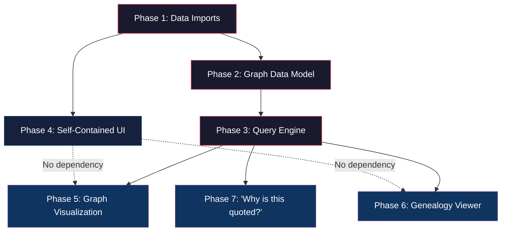
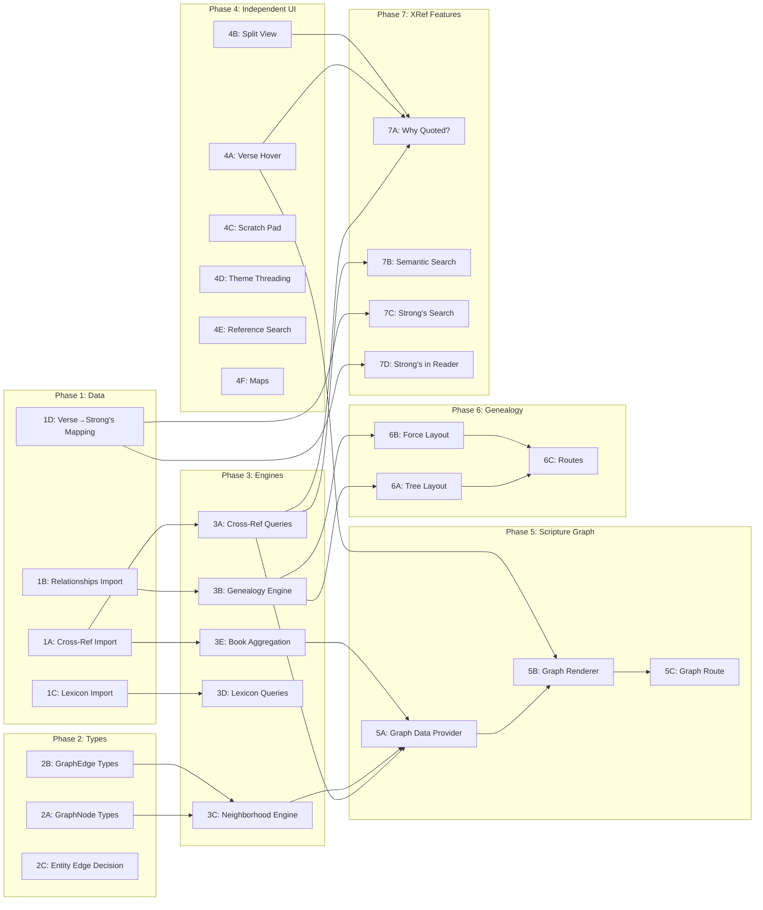

# v0.4.0: Deep Study (Connect & Graph) — Architectural Decomposition

> **Role:** Principal Engineer — System Architecture & Milestone Planning
> **Date:** 2026-04-01
> **Scope:** Decompose v0.4.0 into buildable phases with strict sequencing, dependency chains, and risk analysis.
> **Constraint:** No implementation code. Decisions only.

---

## Executive Summary

v0.4.0 is the most architecturally dangerous milestone in the Codex Scriptura roadmap. It introduces **four new core systems simultaneously** — a knowledge graph, cross-references, lexical data, and three complex visualization surfaces (scripture graph, genealogy viewer, split view). Any of these alone would be a significant milestone. Combined naively, they create a dependency web that guarantees rework.

**The solution is strict phase sequencing.** We build **data models and engines first**, then **query layers**, then **UI surfaces**. No UI work begins until the data it depends on is provably correct and queryable.

---

## I. Core Systems Identification

### System 1: Graph Data Model (Foundation Layer)
The unified node/edge structure that every v0.4.0 feature reads from. This is NOT the graph visualization — it is the **data substrate** underneath everything.

| Concern | Detail |
|---|---|
| **Nodes** | Verses, persons, places, events, books, chapters |
| **Edges** | Cross-references (typed: quotation, allusion, theme, keyword), entity→verse links, genealogy relationships |
| **Storage** | Dexie tables with compound indexes |
| **Query API** | `getEdgesFrom(nodeId, type?, depth?)`, `getNeighborhood(nodeId, hops)` |

### System 2: Cross-Reference System
The typed, directional edge dataset connecting passages. This is the primary new data import for v0.4.0.

| Concern | Detail |
|---|---|
| **Data source** | Treasury of Scripture Knowledge (TSK) — 63,000+ cross-references, public domain |
| **Edge types** | `quotation`, `allusion`, `theme`, `keyword` |
| **Storage** | New `crossReferences` Dexie table |
| **Directionality** | Source → target, with optional bidirectional flag |

### System 3: Lexical / Strong's System
Strong's concordance numbers mapped to Hebrew/Greek lemmas, enabling lexical search and word study.

| Concern | Detail |
|---|---|
| **Data source** | BibleData `HebrewStrongs.csv`, `GreekStrongs.csv` |
| **Storage** | New `lexicon` Dexie table |
| **Activation** | Requires either a Strong's-tagged OSIS source OR a verse→Strong's mapping built from BibleData CSVs |
| **Existing scaffolding** | `VerseRecord.lemmas`, `ConcordanceSearchMode: 'lexical'`, `extractLemmas()` — all exist but are unpopulated |

### System 4: UI Interaction Systems
The visualization and interaction surfaces that consume the above data.

| Sub-system | Depends on |
|---|---|
| **Verse hover preview** | Verse lookup (exists) |
| **Split view** | `ReaderPane` refactor (done in v0.3.0) |
| **Scratch pad** | Annotation system (exists) |
| **Scripture graph** | Graph data model + cross-references + entity edges |
| **Genealogy viewer** | Relationships table + `buildPersonSubgraph` engine |
| **"Why is this quoted?"** | Cross-reference system with `quotation` edge type |
| **Theme threading** | Annotation system (exists) |
| **Maps** | Place data with lat/lng (exists) |
| **Reference search** | `parseReference()` (exists in `@codex-scriptura/core`) |

---

## II. Strict Build Order



### Phase 1 → Phase 2 → Phase 3 is the CRITICAL PATH
Nothing that reads graph data can be built before Phase 3 is complete. Phases 4's items are **independent** and can be built in parallel with Phase 2/3.

---

## III. Phase Definitions

---

### Phase 1: Data Imports & Schema Extension
**Priority:** CRITICAL PATH — must be first
**Estimated scope:** Schema changes + 4 importer scripts + seed pipeline extension

#### Deliverables

##### 1A. Cross-Reference Import

**Data source decision (REQUIRED BEFORE CODING):**

> [!IMPORTANT]
> The roadmap says "Cross-reference schema and importer" but does not specify a dataset. This is the first decision that must be made. The Treasury of Scripture Knowledge (TSK) is the most complete public-domain cross-reference dataset (~63,000 entries). Alternatives (OpenBible cross-references, Nave's Topical Bible) are smaller and less structured. **Recommendation: TSK as primary, with edge type classification as a post-import enrichment step.**

- New Dexie table: `crossReferences`
- Schema: `'id, sourceVerse, targetVerse, type, [sourceVerse+type], [targetVerse+type]'`
- Type: `CrossReference` in `@codex-scriptura/core`
```
type CrossReferenceType = 'quotation' | 'allusion' | 'theme' | 'keyword' | 'parallel' | 'unclassified';

type CrossReference = {
    id: string;                    // deterministic: `${sourceVerse}→${targetVerse}`
    sourceVerse: string;           // OSIS ID e.g. "Matt.4.4"
    targetVerse: string;           // OSIS ID e.g. "Deut.8.3"
    type: CrossReferenceType;
    bidirectional: boolean;        // true for parallel passages (e.g. synoptic gospels)
    confidence?: number;           // 0-1 for programmatically classified edges
};
```
- Importer: `import-cross-references.ts` → `data/processed/metadata/cross-references.json`
- Seed extension: `seedCrossReferences()` in `seed.ts`

##### 1B. Relationships Import (Genealogy Data)

- New Dexie table: `relationships`
- Schema: `'id, personFrom, personTo, type, [personFrom+type], [personTo+type]'`
- Type: `Relationship` in `@codex-scriptura/core`
```
type RelationshipType = 'father-of' | 'mother-of' | 'spouse-of' | 'sibling-of' | 'half-sibling-same-father' | 'ancestor-of';

type Relationship = {
    id: string;
    personFrom: string;   // Person ID
    personTo: string;     // Person ID
    type: RelationshipType;
};
```
- Importer: `import-theographic-relationships.ts` → `data/processed/relationships/genealogy.json`
- Source: BibleData `PersonRelationship.csv` (has typed edges that Theographic lacks)

##### 1C. Strong's / Lexicon Import

- New Dexie table: `lexicon`
- Schema: `'id, strongsNumber, language, lemma'`
- Type: `LexiconEntry` in `@codex-scriptura/core`
```
type LexiconEntry = {
    id: string;              // e.g. "H430" or "G2316"
    strongsNumber: string;
    language: 'hebrew' | 'greek';
    lemma: string;           // Original language word
    transliteration: string;
    gloss: string;           // Short English definition
    description?: string;    // Extended definition
};
```
- Two importers: `import-bibledata-hebrew-strongs.ts`, `import-bibledata-greek-strongs.ts`
- Output: `lexicon-hebrew.json`, `lexicon-greek.json`

##### 1D. Verse→Strong's Mapping (Data Acquisition)

> [!WARNING]
> This is the **highest-risk data task** in the entire milestone. The existing KJV/OEB/WEB source texts contain NO `<w lemma="...">` markup. Two paths exist:
> 1. **Acquire a Strong's-tagged OSIS KJV** (e.g., from OpenScriptures `morphhb`/`morphgnt` or a community-tagged KJV OSIS) and re-import via the existing `extractLemmas()` pipeline. This populates `VerseRecord.lemmas`.
> 2. **Build a verse→Strong's mapping table** from BibleData CSVs (if they contain verse-level Strong's assignments). This would be a new join table rather than enriching `VerseRecord`.
>
> **Decision required:** Which path? Path 1 is cleaner (data lives on the verse record). Path 2 is more pragmatic (no re-import of 31K verses). If neither dataset provides verse-level Strong's assignments, Strong's *search* is blocked and should be deferred to v0.5.0. The Strong's *lexicon lookup* (type H430 → see definition) still works regardless.

#### Done Criteria (Phase 1)
- [ ] All 4 new Dexie tables exist with indexed schemas
- [ ] All 4 type definitions exported from `@codex-scriptura/core`
- [ ] All importer scripts run successfully and produce valid JSON
- [ ] `copy-to-static.ts` updated to include new JSON files
- [ ] `seed.ts` extended with `seedCrossReferences()`, `seedRelationships()`, `seedLexicon()`
- [ ] Dexie version bumped (v9 and v10)
- [ ] Data can be queried raw from browser console: `db.crossReferences.count()` returns >0

#### What Must NOT Be Built (Phase 1)
- ❌ No graph query engine
- ❌ No UI components
- ❌ No visualization
- ❌ No search integration
- ❌ No hover previews

---

### Phase 2: Graph Data Model & Unified Edge Abstraction
**Priority:** CRITICAL PATH — depends on Phase 1
**Purpose:** Create a unified query interface over the heterogeneous edge types (cross-references, entity→verse links, genealogy relationships)

#### Deliverables

##### 2A. Graph Node Abstraction
- File: `packages/core/src/graph.ts`
- A `GraphNode` type that normalizes verses, persons, places, events, books, and chapters into a common node shape for graph queries:
```
type GraphNodeType = 'verse' | 'person' | 'place' | 'event' | 'book' | 'chapter';

type GraphNode = {
    id: string;
    type: GraphNodeType;
    label: string;        // Human-readable: "Genesis 1:1" or "Moses"
    data?: unknown;       // The raw record (VerseRecord | Person | Place | etc.)
};
```

##### 2B. Graph Edge Abstraction
- Unified `GraphEdge` type that wraps cross-references, entity→verse links, and genealogy edges:
```
type GraphEdgeCategory = 'cross-reference' | 'entity-mention' | 'genealogy';

type GraphEdge = {
    id: string;
    source: string;       // GraphNode.id
    target: string;       // GraphNode.id
    category: GraphEdgeCategory;
    type: string;         // Specific type within category (e.g. 'quotation', 'father-of')
    weight?: number;      // Strength/confidence signal
};
```

##### 2C. Entity→Verse Edge Materialization
- The existing `Person.verseRefs`, `Place.verseRefs`, `Event.verseRefs` arrays are **implicit edges**. They are queryable via Dexie multi-entry indexes but are not stored as explicit graph edges.
- **Decision: Do NOT materialize these as rows in an edges table.** The entity tables already have multi-entry indexes on `verseRefs`. Materializing ~500K entity→verse edges into a separate table would explode IndexedDB storage for zero query benefit. Instead, the graph query engine (Phase 3) will synthesize `GraphEdge` objects on-the-fly from entity lookups.

#### Done Criteria (Phase 2)
- [ ] `GraphNode`, `GraphEdge`, and related types exported from `@codex-scriptura/core`
- [ ] Type system compiles — no runtime code yet beyond type definitions
- [ ] Clear documentation in `architecture.md` explaining the graph abstraction

#### What Must NOT Be Built (Phase 2)
- ❌ No query engine implementation (that's Phase 3)
- ❌ No D3 or visualization code
- ❌ No UI components

---

### Phase 3: Graph Query Engine
**Priority:** CRITICAL PATH — depends on Phase 2
**Purpose:** The runtime query layer that resolves neighborhoods, traverses edges, and enforces complexity caps

#### Deliverables

##### 3A. Cross-Reference Query API
- File: `packages/db/src/index.ts` (extend with new repository helpers)
- Functions:
  - `getCrossReferencesFrom(osisId: string): Promise<CrossReference[]>`
  - `getCrossReferencesTo(osisId: string): Promise<CrossReference[]>`
  - `getCrossReferencesBetweenBooks(bookA: string, bookB: string): Promise<CrossReference[]>`
  - `getCrossReferenceCountByBook(): Promise<Map<string, Map<string, number>>>` — aggregate density matrix for zoomed-out graph

##### 3B. Genealogy Engine
- File: `src/lib/engines/genealogy.ts`
- Function: `buildPersonSubgraph(personId: string, depth: number): { nodes: GraphNode[], edges: GraphEdge[] }`
- BFS traversal across the `relationships` Dexie table
- Hard depth cap: 4 hops (enforced in engine, not UI)
- Node count warning threshold: configurable, default 80

##### 3C. Neighborhood Query Engine
- File: `src/lib/engines/graph.ts`
- Function: `getNeighborhood(nodeId: string, hops: number, filters?: GraphFilters): { nodes: GraphNode[], edges: GraphEdge[] }`
- This is the **general-purpose graph traversal** that the scripture graph visualization will call
- `GraphFilters`:
```
type GraphFilters = {
    edgeCategories?: GraphEdgeCategory[];
    edgeTypes?: string[];        // e.g. ['quotation', 'allusion']
    maxNodes?: number;           // Hard cap, default 120
    nodeTypes?: GraphNodeType[]; // e.g. ['verse', 'person']
};
```
- Must handle multi-source edge synthesis: cross-references from `crossReferences` table + entity mentions from `persons`/`places`/`events` tables

##### 3D. Lexicon Query API
- File: `packages/db/src/index.ts`
- Functions:
  - `getLexiconEntry(strongsNumber: string): Promise<LexiconEntry | undefined>`
  - `searchLexicon(query: string): Promise<LexiconEntry[]>` (gloss/lemma search)
  - `getStrongsForVerse(osisId: string): Promise<LexiconEntry[]>` (requires verse→Strong's mapping from Phase 1D)

##### 3E. Book-Level Aggregation Engine
- File: `src/lib/engines/graph.ts`
- Function: `getBookCrossReferenceMatrix(): BookConnectionMatrix`
- Produces the zoomed-out view data: weighted edges between books based on cross-reference density
- This is computed once and cached (it's static data) — NOT computed on every graph render

#### Done Criteria (Phase 3)
- [ ] All query functions return correct results against seeded data
- [ ] `buildPersonSubgraph('Moses', 2)` returns a reasonable subgraph
- [ ] `getNeighborhood('John.3.16', 1)` returns cross-references + entity mentions
- [ ] `getBookCrossReferenceMatrix()` produces a 66×66 density matrix
- [ ] Node cap enforcement works: requesting a neighborhood that exceeds 120 nodes returns a truncated result with a `truncated: true` flag
- [ ] All functions are testable from browser console

#### What Must NOT Be Built (Phase 3)
- ❌ No visualization / rendering code
- ❌ No Svelte components
- ❌ No D3 imports

---

### Phase 4: Self-Contained UI Features (PARALLEL TRACK)
**Priority:** Can begin as soon as Phase 1 completes
**Purpose:** Build UI features that do NOT depend on the graph query engine

> [!TIP]
> These features are **independent of the critical path** and can be developed in parallel with Phases 2-3 by a second developer, or interleaved as a change of pace.

#### 4A. Verse Hover Preview
- Component: Reuse `EntityDetailPanel` pattern — new `VersePreviewCard.svelte`
- Trigger: `mouseenter` on any `[data-osis]` element with 400ms delay (`setTimeout`, cancelled on `mouseleave`)
- Data: `getVerse(translationId, osisId)` — **already exists**
- Behavior: Floating card positioned near cursor, shows verse text + reference. Click navigates. Cmd+click opens in new split pane (deferred to after split view is built).
- **Done:** Hovering a verse reference anywhere in the app shows the verse text in a floating card.

#### 4B. Split View
- Already architecturally designed in `architecture.md` (§ Split View / Reader Workspace)
- `ReaderPane.svelte` and `ReaderWorkspace.svelte` already exist from v0.3.0 refactor
- Implementation: `PaneState` array, flex-basis dividers, sync scroll
- **Done:** User can open 1-3 panes, each with independent book/chapter/translation. Sync scroll works. Layout persists across refresh.

#### 4C. Scratch Pad
- Already architecturally designed in `architecture.md` (§ Scratch Pad)
- Singleton Dexie `Settings` record under key `'scratchPad'`
- Cmd+Shift+P toggle
- Verse dropping from selection toolbar
- **Done:** Scratch pad opens, accepts verse drops, persists across navigation, "Convert to note" works.

#### 4D. Theme Threading
- Annotation subtype `type: 'theme'` in existing `Annotations` table
- No schema change — add a `'theme'` value to the `AnnotationType` union
- Thread view: filtered search results at `/study/theme/:slug` or from `/search`
- **Done:** User can tag verses with theme labels and view all verses in a theme as a filtered list.

#### 4E. Reference Search
- `parseReference()` already exists in `@codex-scriptura/core`
- Wire it into the Command Palette: if input matches a Bible reference pattern, show it as the top result and navigate on select
- **Done:** Typing "John 3:16" in Cmd+K navigates directly to that verse.

#### 4F. Maps (Basic)
- Leaflet/MapLibre tile map inside `EntityDetailPanel` for places with `confidence >= 0.5`
- No custom tile server — use free OSM tiles
- **Done:** Places with coordinates show a small map in the entity detail panel.

#### Done Criteria (Phase 4)
Each sub-feature has its own "Done" above. All 6 can ship independently.

#### What Must NOT Be Built (Phase 4)
- ❌ No graph visualization (depends on Phase 3)
- ❌ No "Why is this quoted?" (depends on cross-reference queries)
- ❌ No genealogy viewer (depends on engine)
- ❌ No semantic search (depends on graph traversal)

---

### Phase 5: Scripture Graph Visualization
**Priority:** Depends on Phase 3 completion
**Purpose:** The progressive-disclosure zoomable graph view

#### Deliverables

##### 5A. Graph Data Provider
- File: `src/lib/engines/graph-view.ts`
- Responsibilities:
  - Translate zoom level into query parameters
  - Zoomed out → `getBookCrossReferenceMatrix()` (cached)
  - Mid zoom → `getCrossReferencesBetweenBooks(bookA, bookB)` aggregated to chapter level
  - Zoomed in → `getNeighborhood(verseOsisId, 1, filters)`
  - Enforce visible node cap (120) at every transition
  - Return `{ nodes: GraphNode[], edges: GraphEdge[], level: 'book' | 'chapter' | 'verse', truncated: boolean }`

##### 5B. Graph Renderer (First-Party Plugin Pattern)
- Component: `ScriptureGraph.svelte`
- Rendering: D3 force simulation (or Canvas-based — decision deferred to implementation)
- Interactions: click to expand cluster, double-click to collapse, hover for preview card (uses 4A VersePreviewCard), drag to reposition
- Filtering UI: edge type checkboxes, entity type checkboxes
- Depth slider: 1-4 hops (only visible at verse zoom level)
- Truncation message: "Too many connections — zoom in or filter" when `truncated: true`

##### 5C. Route
- `/study/graph` — standalone deep-exploration route
- Entry from reader: "View connections" button on verse toolbar or entity detail panel

#### Done Criteria (Phase 5)
- [ ] Zoomed-out view shows 66 book nodes with weighted edges
- [ ] Clicking a book node expands it to chapter-level nodes
- [ ] Clicking a chapter node shows verse-level connections (1-hop default)
- [ ] Filters reduce visible edges before rendering
- [ ] Node cap enforced — never renders >120 nodes
- [ ] Hover shows verse preview card
- [ ] Clicking a verse node navigates to the reader

#### What Must NOT Be Built (Phase 5)
- ❌ No 3D rendering or WebGL
- ❌ No full-database force layout (the hairball anti-pattern)
- ❌ No AI-powered "smart clustering"

---

### Phase 6: Genealogy Viewer
**Priority:** Depends on Phase 3B (genealogy engine)
**Purpose:** Interactive family tree / relationship visualization

#### Deliverables

##### 6A. Tree Layout Mode
- D3 `tree()` for lineage passages
- Top-down or left-right orientation
- Activated for Matthew 1, Luke 3, Genesis 5 or via user toggle

##### 6B. Force/Graph Layout Mode
- D3 force simulation, draggable nodes
- Expand-on-click (adds 1 hop), depth slider (1–4)
- Node fill encoding: patriarch (blue), matriarch (green), descendant (purple), unresolved (grey + "?")
- Edge style encoding per relationship type (solid/dashed/dotted per architecture.md)

##### 6C. Routes & Entry Points
- Standalone: `/study/person/:id` — full-featured viewer with all controls
- Contextual: mini-graph launched from `EntityDetailPanel` or "Who's Here?" panel (depth 1-2, no depth slider)

#### Done Criteria (Phase 6)
- [ ] `/study/person/Abraham` shows Abraham's family tree in tree mode
- [ ] Force mode is default for open exploration
- [ ] Depth slider works and respects 4-hop cap
- [ ] Node count warning appears above threshold
- [ ] Contextual mini-graph works from entity panel
- [ ] Edge types are visually distinguishable

#### What Must NOT Be Built (Phase 6)
- ❌ No timeline integration (that's v0.5.0)
- ❌ No person comparison view
- ❌ No editing of relationships

---

### Phase 7: Cross-Reference Integration Features
**Priority:** Depends on Phase 3A (cross-reference queries)
**Purpose:** Features that surface cross-references inline in the reader

#### Deliverables

##### 7A. "Why Is This Quoted?"
- Inline badge on NT verses that quote OT passages
- Requires `crossReferences` query filtered to `type: 'quotation'` for the current chapter
- Click badge → hover card with OT source text (uses VersePreviewCard from 4A)
- Click card → navigates or opens in split pane

##### 7B. Semantic/Topical Search
- Search mode that traverses graph metadata: "verses about forgiveness" resolves to entity mentions + thematic cross-references + theme tags
- Implementation: query `crossReferences` by type `theme`, cross-reference with entity data, rank by edge density
- This is **not** NLP/AI — it's structured graph traversal over curated data

##### 7C. Strong's Number Search (if 1D resolved)
- Activate `ConcordanceSearchMode: 'lexical'` in search UI
- Input: Strong's number (e.g. "H430")
- Lookup: `getLexiconEntry('H430')` → show lemma/gloss
- Search: find all verses with that Strong's in `lemmas` field (or via mapping table)
- If 1D is NOT resolved: this item is **deferred to v0.5.0**. The lexicon lookup (Phase 1C) still ships.

##### 7D. Strong's Concordance Integration (Lexicon Lookups in Reader)
- When reading, a word with a known Strong's mapping shows a small superscript number
- Clicking it opens the lexicon entry in `EntityDetailPanel`
- Depends on 1C (lexicon data) and 1D (verse→Strong's mapping)

#### Done Criteria (Phase 7)
- [ ] "Why is this quoted?" badges appear on NT quotation verses
- [ ] Clicking a badge shows the OT source in a hover card
- [ ] Strong's lexicon entries display correctly (even if search is deferred)
- [ ] Semantic search returns structured results from graph traversal

---

## IV. Dependency Graph (Complete)



---

## V. Critical Path

The **minimal sequence that unlocks everything else:**

```
Phase 1A (Cross-Ref Import)
    → Phase 2A/2B (Graph Types)
        → Phase 3A (Cross-Ref Queries)
            → Phase 3C (Neighborhood Engine)
                → Phase 5A (Graph Data Provider)
                    → Phase 5B (Graph Renderer)
```

**This is a strict 6-step waterfall.** No parallelism exists on the critical path. Each step MUST be complete before the next begins.

**Total critical path items:** 6 (of 26 total deliverables)

**Everything else branches off this spine:**
- Phase 3B (genealogy engine) branches from Phase 1B, parallel to the critical path
- Phase 4 (all 6 items) branches from Phase 1 completion, fully parallel
- Phase 7 branches from Phase 3A, parallel to Phase 5

---

## VI. Parallelization Opportunities

| Can run in parallel | Constraint |
|---|---|
| Phase 4 (all 6 items) with Phases 2-3 | Phase 1 must complete first |
| Phase 6 with Phase 5 | Both depend on Phase 3 but not on each other |
| Phase 7A/7B with Phase 5 | Both depend on Phase 3A but not on each other |
| Items 4A-4F with each other | All are independent |
| 1A, 1B, 1C, 1D with each other | All are independent data imports |

**Maximum parallelism:** After Phase 1 completes, up to 3 workstreams can proceed simultaneously:
1. Critical path (Phases 2→3→5)
2. Independent UI (Phase 4)
3. Genealogy track (Phase 3B → Phase 6)

---

## VII. Architectural Risks

### Risk 1: Cross-Reference Data Quality
**Severity: HIGH**
**What:** TSK data is untyped — every cross-reference is just "related." The roadmap requires typed edges (quotation, allusion, theme, keyword). Manually classifying 63,000 entries is infeasible.

**Mitigation:** Import all TSK entries as `type: 'unclassified'`. Build a deterministic classifier as a post-processing step:
- NT→OT references where the NT text contains a direct quote → `quotation`
- Synoptic parallel passages → `parallel`
- Everything else → `unclassified`
- Allow future probabilistic classifiers to upgrade `unclassified` edges

**Enforcement:** The UI MUST handle `unclassified` gracefully. Do NOT design filters that assume every edge has a meaningful type.

---

### Risk 2: Graph Explosion (The Hairball)
**Severity: CRITICAL**
**What:** A vertex like "God" or "Jesus" has connections to thousands of verses. A naive 2-hop traversal from John 3:16 could return 10,000+ nodes.

**Mitigation:**
- Hard node cap (120) enforced at the **engine level**, not the UI level
- Default to 1-hop. Depth slider increments are earned, not free
- `getNeighborhood()` returns `{ truncated: true, totalAvailable: N }` when capped
- Zoomed-out book-level view is pre-computed (Phase 3E), not dynamically traversed

**Enforcement:** If a query returns >120 nodes, the engine MUST truncate. The UI MUST NOT override this cap. No "show all" button.

---

### Risk 3: IndexedDB Storage Pressure
**Severity: MEDIUM**
**What:** Adding 63K+ cross-references, 10K+ relationships, and 14K+ lexicon entries to IndexedDB alongside 31K+ verses per translation could push total storage past the browser's quota warning threshold (~50MB on some browsers).

**Mitigation:**
- Cross-references are small records (~100 bytes each) — 63K × 100B = ~6MB. Manageable.
- Do NOT materialize entity→verse edges as rows (Decision 2C). This saves ~50MB.
- Monitor `navigator.storage.estimate()` on seed completion and warn if >80% quota used.

---

### Risk 4: Verse→Strong's Mapping Unavailability
**Severity: HIGH**
**What:** If no public-domain verse-level Strong's tagged source can be acquired, Strong's *search* (7C) and Strong's *in-reader* (7D) are blocked. The lexicon *lookup* (type H430 → see definition) still works.

**Mitigation:**
- Treat Strong's search as **conditional on data availability**
- Scope Phase 1D as a **research spike** with a go/no-go decision deadline before Phase 3D implementation
- If blocked: defer 7C and 7D to v0.5.0 where morphologically tagged texts (morphhb/morphgnt) are already planned
- Ship the lexicon lookup UI regardless — it's valuable even without verse-level integration

---

### Risk 5: D3 Bundle Size
**Severity: MEDIUM**
**What:** D3 is a large library (~230KB minified). Importing the full bundle for two visualization features would significantly impact first-load performance.

**Mitigation:**
- Use D3 subpackages: `d3-force`, `d3-hierarchy`, `d3-selection`, `d3-zoom` only
- Dynamic `import()` — never in the main bundle. Graph and genealogy routes lazy-load D3
- Consider Canvas rendering instead of SVG for the scripture graph (better performance at 120 nodes)

---

### Risk 6: Split View State Complexity
**Severity: MEDIUM**
**What:** 3 independent reader panes, each with its own Dexie queries, scroll position, entity panel interactions, and annotation state creates a state coordination challenge.

**Mitigation:**
- Each `ReaderPane` is **fully self-contained** — it owns its own data queries. No shared state between panes except sync scroll.
- `EntityDetailPanel` remains **workspace-level** (one instance, outside the pane row). Panes don't own panels.
- Split view state is a simple `PaneState[]` array. No cross-pane state machine.
- Build split view BEFORE "Why is this quoted?" so that "Open in new pane" has a target.

---

### Risk 7: Scratch Pad Scope Creep
**Severity: LOW but insidious**
**What:** The scratch pad sounds simple but tends to attract feature requests: rich text editing, verse-level anchoring, collaborative sharing, Markdown export, etc.

**Mitigation:** Strict v0.4.0 scope:
- Plain text + structured verse blocks. No rich text editor.
- "Convert to note" is the upgrade path — do not replicate the annotation editor inside the scratch pad.
- No sharing, no export, no sync.

---

### Risk 8: Theme Threading vs. Tagging Confusion
**Severity: LOW**
**What:** The existing `Tag` system and the new "theme threading" could overlap conceptually, confusing users.

**Mitigation:**
- Theme tags are an `AnnotationType`, not a `Tag`. They use the annotation system, not the tag taxonomy.
- A theme annotation has `type: 'theme'`, `data: 'covenant'` (the theme label).
- This is architecturally distinct from tags, which are organizational metadata on annotations.
- Document this distinction in `architecture.md`.

---

### Risk 9: Map Tile Dependency
**Severity: LOW**
**What:** Maps depend on external tile servers (OSM/MapTiler/Mapbox). In an offline-first app, this means maps won't work offline unless tiles are cached.

**Mitigation:**
- Maps are explicitly a best-effort online feature in v0.4.0.
- Show a graceful "Map unavailable offline" placeholder.
- Full offline map support (tile caching, MBTiles) is out of scope — that's a plugin concern post-v0.6.0.

---

### Risk 10: Progressive Disclosure Complexity
**Severity: MEDIUM**
**What:** The three-level zoom model (book → chapter → verse) requires three different data representations, three different rendering strategies, and smooth transitions between them. This is a miniature application within the application.

**Mitigation:**
- Phase 5A (Graph Data Provider) is a **separate module** from 5B (Graph Renderer). The provider handles the zoom-level state machine; the renderer is a dumb consumer.
- Start with two levels (book and verse) and add the mid-level (chapter) only if the UX demands it. The architecture supports it, but shipping two levels first reduces scope.
- Do NOT animate zoom transitions in v0.4.0. Crossfade or instant switch is sufficient.

---

### Risk 11: First-Party Plugin Pattern Without Plugin API
**Severity: MEDIUM**
**What:** The roadmap says the graph renderer and genealogy viewer should follow "plugin API conventions" — but the plugin API (`packages/plugin-api`) is empty and isn't defined until v0.6.0. Building to an undefined contract is dangerous.

**Mitigation:**
- Do NOT attempt to define the plugin API in v0.4.0. That would be premature.
- Instead, build the graph renderer and genealogy viewer as **normal Svelte components** that consume data from the graph engine via clean function imports.
- The architectural boundary is: engine functions live in `src/lib/engines/`, visualization components live in `src/lib/components/`. This separation is sufficient for future extraction into plugins.
- When v0.6.0 arrives, these components become the reference implementation for the plugin API — but they don't need to predict it now.

---

## VIII. Enforcement Disciplines

### Rule 1: No UI Without Queryable Data
Any PR that introduces a Svelte component consuming graph data will be rejected if the underlying query function doesn't exist and return correct results. **Test the engine in the browser console first, then build the UI.**

### Rule 2: No Visualization Before the Engine
D3, Canvas, or any rendering library must not appear in the codebase until Phase 3 is complete and verified. Import a rendering library into `engines/` module? Rejected.

### Rule 3: Node Cap Is Non-Negotiable
The 120-node cap is enforced in the engine (`getNeighborhood`), not in the UI. Any code path that bypasses this cap is a bug, not a feature. There is no "advanced mode" that shows unlimited nodes.

### Rule 4: No Premature Plugin API
Do not define plugin hooks, lifecycle events, or message passing protocols in v0.4.0. The visualization components are regular Svelte components. "Plugin-ready architecture" means clean separation of engine and renderer — it does NOT mean building a plugin runtime.

### Rule 5: Data Source Decisions Are Blocking
Phase 1 cannot begin implementation until the cross-reference data source (TSK vs. alternative) and the Strong's mapping path (re-import vs. mapping table vs. defer) are decided. These are architectural decisions, not implementation details.

### Rule 6: No Feature That Skips Phases
If someone proposes adding "smart graph suggestions" or "AI-powered cross-reference discovery" — rejected. If someone proposes "let's add the graph UI first and fill in the data later" — rejected. The phase order is not a suggestion.

### Rule 7: Semantic Search Is Graph Traversal, Not NLP
"Verses about forgiveness" resolves to: (1) entity mentions matching "forgiveness", (2) cross-references with type `theme` tagged "forgiveness", (3) theme annotations with label "forgiveness". It is NOT vector embeddings, LLM inference, or any form of ML. If it requires a model, it's out of scope.

---

## IX. Open Questions Requiring Decision

> [!IMPORTANT]
> **These must be resolved before Phase 1 coding begins.**

1. **Cross-reference data source:** TSK is recommended. Is there a preferred alternative? Should we pursue multiple sources and merge?

2. **Strong's verse mapping path:** Re-import a tagged KJV (cleaner) vs. build a mapping table from BibleData (faster) vs. defer to v0.5.0 (safest)? This determines whether 7C and 7D ship in v0.4.0.

3. **Graph renderer technology:** D3 force simulation (mature, SVG-based, many examples) vs. Canvas/WebGL (better performance at scale, harder to implement interactions)? Recommendation: D3 force with SVG for v0.4.0, upgrade to Canvas if performance is insufficient.

4. **Map tile provider:** OpenStreetMap (free, no API key) vs. MapTiler (free tier, better styling) vs. Mapbox (best styling, requires API key — violates offline-first principle)?

5. **Mid-zoom level scope:** Should the book→chapter→verse three-level zoom ship in v0.4.0, or should we ship book→verse (two levels) and add the chapter level based on UX feedback?

---

## X. Recommended Milestone Sub-Releases

To avoid a monolithic v0.4.0 release, I recommend these intermediate tags:

| Tag | Contents | Gate |
|---|---|---|
| `v0.4.0-alpha.1` | Phase 1 complete (all data imports + schema) | Data queryable from console |
| `v0.4.0-alpha.2` | Phase 2 + 3 complete (graph types + engines) | Engine functions return correct results |
| `v0.4.0-alpha.3` | Phase 4 complete (independent UI features) | Split view, scratch pad, maps, hover preview working |
| `v0.4.0-beta.1` | Phase 5 + 6 (graph + genealogy visualization) | Both visualizations render correctly |
| `v0.4.0-rc.1` | Phase 7 + polish | All features integrated, cross-reference badges visible |
| `v0.4.0` | Release | Full milestone complete |
