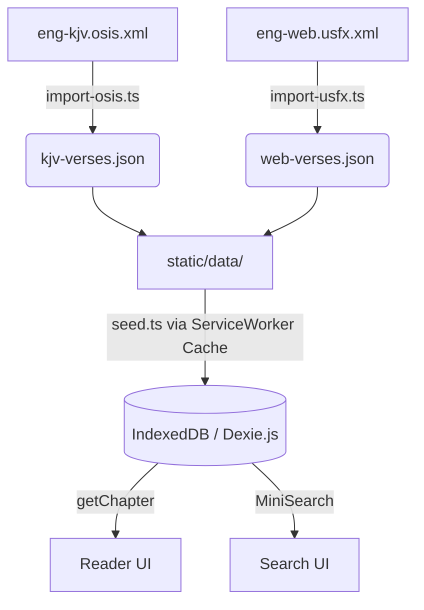

# v0.1.0 "Foundation" - Walkthrough

## What Was Built

### SvelteKit App & Monorepo Packages
The foundation of the offline-first Bible study app has been built across a monorepo structure:
- `packages/core`: Base typings, Canonical 81-book lists, and the `BibleReference` parsing engine.
- `packages/db`: Offline persistence using Dexie.js with 5 tables and compound indexes.
- `packages/data-pipeline`: KJV, OEB, and WEB importers handling both OSIS milestone and USFX XML structures.
- `src/`: SvelteKit app shell, CSS variables design system, `/read` and `/search` UI pages.

### PWA & Offline Support
Codex Scriptura is fully offline capable:
- **`adapter-static`**: Forces SvelteKit to compile into a static HTML SPA (`index.html` fallback).
- **Service Worker (`service-worker.ts`)**: Caches all `.js`/`.css` assets AND statically intercepts all `/data/*.json` requests on install. It uses a **Cache-First** strategy so the entire app works instantaneously without a network trace once loaded once.
- **Web App Manifest**: Permits standalone PWA installation to user devices.

### Documentation & Repo Setup
A complete documentation set has been added for open-source contributors:
- **`README.md`**: Top-level entry point explaining the vision, tech stack, and setup.
- **`docs/getting-started.md`**: Guide for pulling down the monorepo.
- **`docs/local-development.md`**: How to run the Node data-pipeline and test client-side seeding.
- **`docs/architecture.md`**: Explaining the offline-first Dexie sync and planned Plugin model.
- **`docs/branching-strategy.md`**: A simplified GitHub Flow (branch off `main`, squash/merge PRs).
- **`docs/commit-conventions.md`**: Semantic commits (`feat`, `fix`, `docs`) with custom scopes (`core`, `pipeline`, etc.).
- **`docs/release-process.md`**: Pre-1.0 SemVer guidelines and GitHub Release tagging rules.
- **`docs/roadmap.md`**: v0.1.0 through v1.0.0 feature roadmap.
- **`docs/github-setup.md`**: GitHub metadata (Topics, Description) and Issue Label recommendations.
- **`docs/contributing.md`**: Contribution guidelines and architectural non-negotiables.

---

## Data Flow

---

## Verification

| Check | Result |
|-------|--------|
| KJV import | ✅ 36,820 verses (Gen.1.1 → Rev.22.21) |
| OEB import | ✅ 11,722 verses (Ruth.1.1 → Rev.22.21) |
| WEB import | ✅ 36,705 verses (Gen.1.1 → Rev.22.21) |
| Dev server | ✅ Vite 7.3.1, `packages/` alias working |
| Prod Build | ✅ `adapter-static` exported successfully (`pnpm run build` returned 0) |
| PWA Service Worker | ✅ Caches JS/CSS + JSON seeds on install |
| Readme / Docs | ✅ All generated and formatted correctly |

## Remaining for v0.1.0

- [x] PWA: adapter-static + service worker for full offline support **(DONE)**
